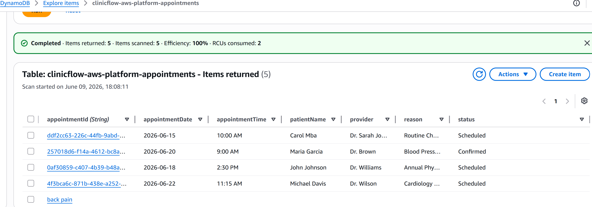

# ClinicFlow AWS Cloud Platform

## Overview

ClinicFlow AWS Cloud Platform is a cloud-native healthcare appointment management application built on AWS using Terraform and serverless technologies. The project demonstrates Infrastructure as Code (IaC), serverless computing, cloud monitoring, and automated deployment practices.

The platform provides appointment management capabilities through a REST API powered by AWS Lambda and API Gateway, while appointment records are stored in Amazon DynamoDB. CloudWatch and SNS are used for monitoring and alerting to ensure operational visibility.

## AWS Architecture

```text
React ClinicFlow Booking Portal
            │
            ▼
      Amazon S3
            │
            ▼
      CloudFront CDN
            │
            ▼
      API Gateway
            │
            ▼
      AWS Lambda
            │
            ▼
       DynamoDB

CloudWatch ───► SNS Alerts
```
## DynamoDB Appointment Records


## Terraform Deployment


## Features

* Appointment creation and retrieval API
* Serverless backend using AWS Lambda
* REST API with API Gateway
* DynamoDB data storage
* React frontend hosting with Amazon S3
* Global content delivery through CloudFront
* Infrastructure provisioning with Terraform
* CloudWatch logging and monitoring
* SNS email notifications for operational alerts
* IAM-based security controls

## Technologies

### Cloud Services

* AWS Lambda
* Amazon API Gateway
* Amazon DynamoDB
* Amazon S3
* Amazon CloudFront
* Amazon CloudWatch
* Amazon SNS
* AWS IAM

### Infrastructure as Code

* Terraform

### Frontend

* React
* Vite
* JavaScript

### Backend

* Python

## Project Structure

```text
ClinicFlow-AWS-Cloud-Platform/
│
├── src/
├── public/
├── package.json
├── vite.config.js
│
├── terraform/
│   ├── provider.tf
│   ├── variables.tf
│   ├── dynamodb.tf
│   ├── iam.tf
│   ├── lambda.tf
│   ├── api-gateway.tf
│   ├── s3-cloudfront.tf
│   ├── cloudwatch-sns.tf
│   └── outputs.tf
│
├── lambda/
│   └── app.py
│
└── README.md
```

## Infrastructure Components

### API Gateway

Provides HTTP endpoints for appointment management.

### AWS Lambda

Executes business logic for appointment creation and retrieval.

### DynamoDB

Stores appointment records using a serverless NoSQL database.

### Amazon S3

Hosts the ClinicFlow frontend application.

### CloudFront

Provides secure and low-latency content delivery.

### CloudWatch

Collects logs and metrics from AWS services.

### SNS

Sends email notifications when CloudWatch alarms are triggered.

## Deployment

### Initialize Terraform

```bash
terraform init
```

### Validate Configuration

```bash
terraform validate
```

### Review Deployment Plan

```bash
terraform plan
```

### Deploy Infrastructure

```bash
terraform apply
```

### Destroy Infrastructure

```bash
terraform destroy
```

## Example Appointment Payload

```json
{
  "patientName": "Carol Mba",
  "provider": "Dr. Smith",
  "appointmentDate": "2026-06-15",
  "appointmentTime": "10:00 AM",
  "reason": "Follow-up Visit",
  "status": "Scheduled"
}
```

## Monitoring and Alerting

The platform includes:

* CloudWatch Logs for Lambda execution
* CloudWatch Metrics for performance monitoring
* CloudWatch Alarms for error detection
* SNS Email Notifications for operational alerts

## Skills Demonstrated

* AWS Cloud Architecture
* Infrastructure as Code (Terraform)
* Serverless Computing
* Cloud Monitoring and Alerting
* REST API Development
* NoSQL Database Design
* Cloud Security and IAM
* Application Deployment
* Troubleshooting and Observability

## Future Enhancements

* User Authentication with Amazon Cognito
* Route 53 Custom Domain
* AWS Certificate Manager (SSL/TLS)
* CI/CD Pipeline with GitHub Actions
* Appointment Search and Filtering
* Patient Management Module
* Provider Scheduling System
* Multi-Environment Deployments (Dev, Test, Prod)

## Author

Carol Mbafou

Healthcare Technology • Cloud Computing • AWS • Terraform • Software Engineering
